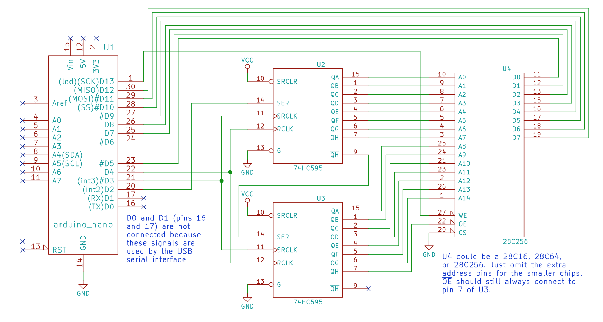

EEPROM Programmer with Arduino Nano

Hardware architecture: Ben Eater's EEPROM Programmer

Supported EEPROMs: 28C16, 28C64, 28C256, and similar parallel EEPROMs.

Given that the Arduino lacks the sufficient number of pins to manage all of the address, data, and control lines of the EEPROM directly, it employs two 74HC595 shift registers. These registers are utilized for the 11 address lines (or 15 for the 28C256 variant) and to handle the output enable control line.

